# AWS Certified Generative AI Developer - Professional (DEV-P01)

## GUIA COMPLETA DE SUBSERVICIOS: Amazon Bedrock & Amazon SageMaker AI

> Documento de referencia para estudio del examen
> Preparado por:  @diegoinoca | Marzo 2026

---

# PARTE 1: AMAZON BEDROCK

Amazon Bedrock es la plataforma fully managed de AWS para construir aplicaciones de IA generativa. Proporciona acceso a foundation models (FMs) de multiples proveedores a traves de una API unificada, junto con herramientas para personalizacion, orquestacion, seguridad y despliegue de agentes.

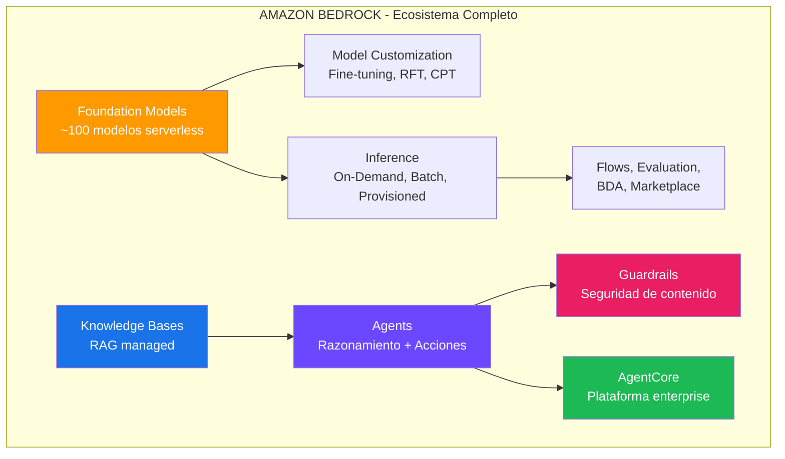
```mermaid
graph TD
    subgraph "AMAZON BEDROCK - Ecosistema Completo"
        FM["Foundation Models<br/>~100 modelos serverless"]
        CUST["Model Customization<br/>Fine-tuning, RFT, CPT"]
        INF["Inference<br/>On-Demand, Batch, Provisioned"]
        KB["Knowledge Bases<br/>RAG managed"]
        AG["Agents<br/>Razonamiento + Acciones"]
        GR["Guardrails<br/>Seguridad de contenido"]
        AC["AgentCore<br/>Plataforma enterprise"]
        OTHER["Flows, Evaluation,<br/>BDA, Marketplace"]
    end

    FM --> CUST
    FM --> INF
    KB --> AG
    AG --> GR
    AG --> AC
    INF --> OTHER

    style FM fill:#FF9900,color:#fff
    style AG fill:#6B48FF,color:#fff
    style KB fill:#1a73e8,color:#fff
    style GR fill:#E91E63,color:#fff
    style AC fill:#1DB954,color:#fff
```

---

## 1.1 Foundation Models (Acceso a Modelos)

Bedrock ofrece acceso serverless a ~100 modelos de multiples proveedores a traves de una API unificada. El desarrollador no gestiona infraestructura.

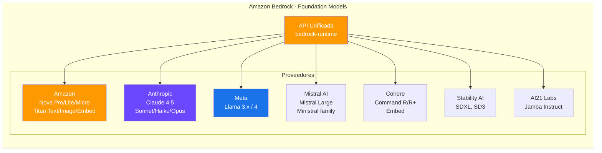
```mermaid
graph LR
    subgraph "Amazon Bedrock - Foundation Models"
        API["API Unificada<br/>bedrock-runtime"]
        
        subgraph "Proveedores"
            AMZ["Amazon<br/>Nova Pro/Lite/Micro<br/>Titan Text/Image/Embed"]
            ANT["Anthropic<br/>Claude 4.5<br/>Sonnet/Haiku/Opus"]
            META["Meta<br/>Llama 3.x / 4"]
            MIS["Mistral AI<br/>Mistral Large<br/>Ministral family"]
            COH["Cohere<br/>Command R/R+<br/>Embed"]
            STAB["Stability AI<br/>SDXL, SD3"]
            AI21["AI21 Labs<br/>Jamba Instruct"]
        end
    end

    API --> AMZ & ANT & META & MIS & COH & STAB & AI21

    style API fill:#FF9900,color:#fff
    style AMZ fill:#FF9900,color:#fff
    style ANT fill:#6B48FF,color:#fff
    style META fill:#1a73e8,color:#fff
```

| Proveedor | Modelos Clave | Fortaleza | Keyword Examen |
|---|---|---|---|
| **Amazon** | Nova Pro, Nova Lite, Nova Micro, Nova Premier, Titan Text/Image/Embed | Costo-efectivo, multimodal, familia completa | "cost-effective", "Amazon model" |
| **Anthropic** | Claude 4.5, Claude Sonnet/Haiku/Opus | Razonamiento avanzado, coding, largo contexto | "advanced reasoning", "complex tasks" |
| **Meta** | Llama 3.x, Llama 4 | Open-weight, customizable | "open source", "self-hosted" |
| **Mistral AI** | Mistral Large, Ministral family | Eficiente, multilingual | "efficient", "multilingual" |
| **Cohere** | Command R/R+, Embed | RAG optimizado, embeddings | "enterprise search", "RAG" |
| **Stability AI** | SDXL, SD3 | Generacion de imagenes | "image generation" |
| **AI21 Labs** | Jamba Instruct | Procesamiento largo contexto | "long context" |

---

## 1.2 Model Customization (Personalizacion)

Bedrock permite personalizar modelos sin gestionar infraestructura de entrenamiento.

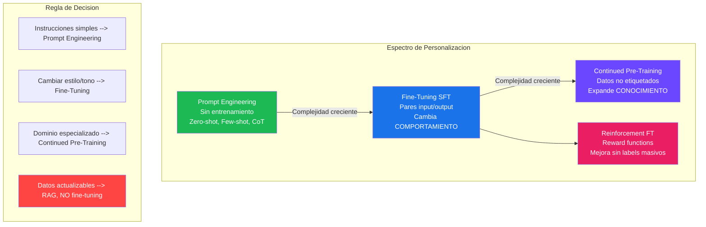
```mermaid
graph TD
    subgraph "Espectro de Personalizacion"
        direction LR
        PE["Prompt Engineering<br/>Sin entrenamiento<br/>Zero-shot, Few-shot, CoT"]
        FT["Fine-Tuning SFT<br/>Pares input/output<br/>Cambia COMPORTAMIENTO"]
        CPT["Continued Pre-Training<br/>Datos no etiquetados<br/>Expande CONOCIMIENTO"]
        RFT["Reinforcement FT<br/>Reward functions<br/>Mejora sin labels masivos"]
    end

    PE -->|"Complejidad creciente"| FT -->|"Complejidad creciente"| CPT
    FT --> RFT

    subgraph "Regla de Decision"
        R1["Instrucciones simples --> Prompt Engineering"]
        R2["Cambiar estilo/tono --> Fine-Tuning"]
        R3["Dominio especializado --> Continued Pre-Training"]
        R4["Datos actualizables --> RAG, NO fine-tuning"]
    end

    style PE fill:#1DB954,color:#fff
    style FT fill:#1a73e8,color:#fff
    style CPT fill:#6B48FF,color:#fff
    style RFT fill:#E91E63,color:#fff
    style R4 fill:#ff4444,color:#fff
```

| Tecnica | Descripcion | Cuando Usar | Keyword |
|---|---|---|---|
| **Fine-Tuning (SFT)** | Supervised Fine-Tuning: entrena con pares input/output etiquetados para adaptar estilo, tono o formato | Cambiar COMPORTAMIENTO del modelo (no datos factuales) | "style", "tone", "format" |
| **Continued Pre-Training** | Entrena el modelo con datos no etiquetados de tu dominio para expandir su conocimiento base | Dominio tecnico especializado (legal, medico) | "domain knowledge", "specialized" |
| **Reinforcement Fine-Tuning (RFT)** | Usa feedback/reward functions para mejorar automaticamente sin datasets etiquetados masivos | Mejorar accuracy sin datos etiquetados, optimizar decisiones | "reward function", "feedback-driven" |
| **Prompt Engineering** | Instrucciones en el prompt sin modificar el modelo (zero-shot, few-shot, CoT) | Ajustes rapidos, sin entrenamiento | "no training", "instructions" |

---

## 1.3 Model Inference (Invocacion)

### Modos de Invocacion

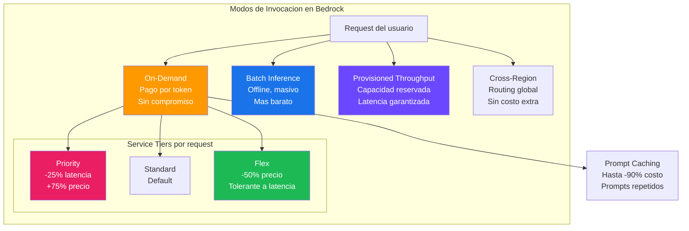
```mermaid
graph TD
    subgraph "Modos de Invocacion en Bedrock"
        REQ["Request del usuario"]
        
        REQ --> OD["On-Demand<br/>Pago por token<br/>Sin compromiso"]
        REQ --> BATCH["Batch Inference<br/>Offline, masivo<br/>Mas barato"]
        REQ --> PROV["Provisioned Throughput<br/>Capacidad reservada<br/>Latencia garantizada"]
        REQ --> CROSS["Cross-Region<br/>Routing global<br/>Sin costo extra"]
        
        subgraph "Service Tiers por request"
            PRI["Priority<br/>-25% latencia<br/>+75% precio"]
            STD["Standard<br/>Default"]
            FLEX["Flex<br/>-50% precio<br/>Tolerante a latencia"]
        end
        
        OD --> PRI & STD & FLEX
    end

    CACHE["Prompt Caching<br/>Hasta -90% costo<br/>Prompts repetidos"]
    OD --> CACHE

    style OD fill:#FF9900,color:#fff
    style BATCH fill:#1a73e8,color:#fff
    style PROV fill:#6B48FF,color:#fff
    style PRI fill:#E91E63,color:#fff
    style FLEX fill:#1DB954,color:#fff
```

| Modo | Descripcion | Keyword Examen |
|---|---|---|
| **On-Demand** | Pago por token, sin compromiso. Modo default. | "flexible", "no commitment" |
| **Batch Inference** | Procesamiento masivo offline, mas barato que on-demand | "large volume", "offline", "cost-effective" |
| **Provisioned Throughput** | Capacidad reservada con throughput garantizado | "consistent latency", "SLA", "predictable" |
| **Cross-Region Inference** | Routing global automatico para evitar limitaciones regionales | "availability", "capacity", "global" |
| **Service Tiers** | Priority (25% menos latencia), Standard, Flex (50% menos costo) | "latency-sensitive" -> Priority, "background" -> Flex |
| **Prompt Caching** | Cachea prompts largos frecuentes, reduce costos hasta 90% | "repeated prompts", "cost reduction" |

### Parametros de Inferencia (CLAVE PARA EXAMEN)

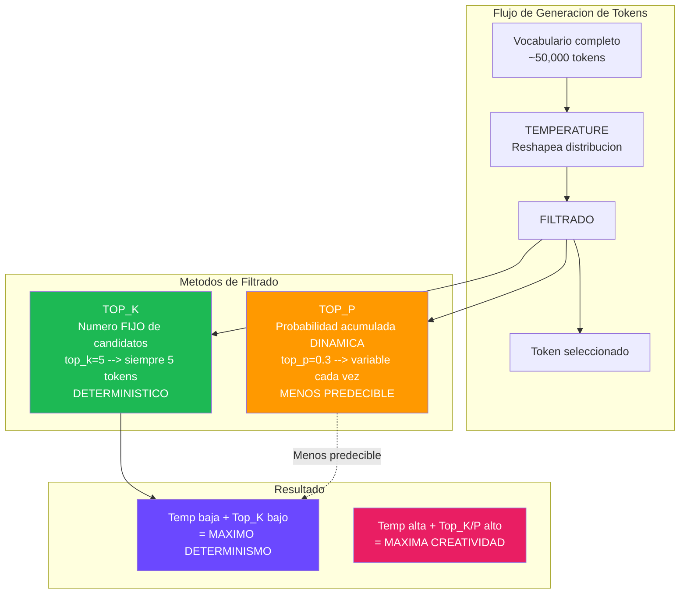
```mermaid
graph TD
    subgraph "Flujo de Generacion de Tokens"
        VOC["Vocabulario completo<br/>~50,000 tokens"]
        TEMP["TEMPERATURE<br/>Reshapea distribucion"]
        FILTER["FILTRADO"]
        SELECT["Token seleccionado"]
        
        VOC --> TEMP --> FILTER --> SELECT
    end

    subgraph "Metodos de Filtrado"
        TOPK["TOP_K<br/>Numero FIJO de candidatos<br/>top_k=5 --> siempre 5 tokens<br/>DETERMINISTICO"]
        TOPP["TOP_P<br/>Probabilidad acumulada DINAMICA<br/>top_p=0.3 --> variable cada vez<br/>MENOS PREDECIBLE"]
    end

    FILTER --> TOPK
    FILTER --> TOPP

    subgraph "Resultado"
        DET["Temp baja + Top_K bajo<br/>= MAXIMO DETERMINISMO"]
        CREA["Temp alta + Top_K/P alto<br/>= MAXIMA CREATIVIDAD"]
    end

    TOPK --> DET
    TOPP -.->|"Menos predecible"| DET

    style TOPK fill:#1DB954,color:#fff
    style TOPP fill:#FF9900,color:#fff
    style DET fill:#6B48FF,color:#fff
    style CREA fill:#E91E63,color:#fff
```

| Parametro | Funcion | Bajar | Subir |
|---|---|---|---|
| **Temperature** | Forma de la distribucion de probabilidad | Mas deterministico, preciso | Mas creativo, diverso |
| **Top_K** | Numero FIJO de tokens candidatos | Menos candidatos (deterministico) | Mas candidatos |
| **Top_P** | Probabilidad acumulada DINAMICA de candidatos | Menos candidatos (variable) | Mas candidatos |
| **Max Tokens** | Limite de tokens en la respuesta | Respuestas mas cortas | Respuestas mas largas |
| **Stop Sequences** | Secuencias donde el modelo deja de generar | N/A | N/A |

> REGLA: Determinismo = Temperature baja + Top_K bajo. Top_K mayor que Top_P para determinismo porque Top_K es fijo, Top_P es dinamico.

---

## 1.4 Knowledge Bases (RAG)

Servicio managed para implementar Retrieval-Augmented Generation sin gestionar vector stores ni pipelines de embedding.

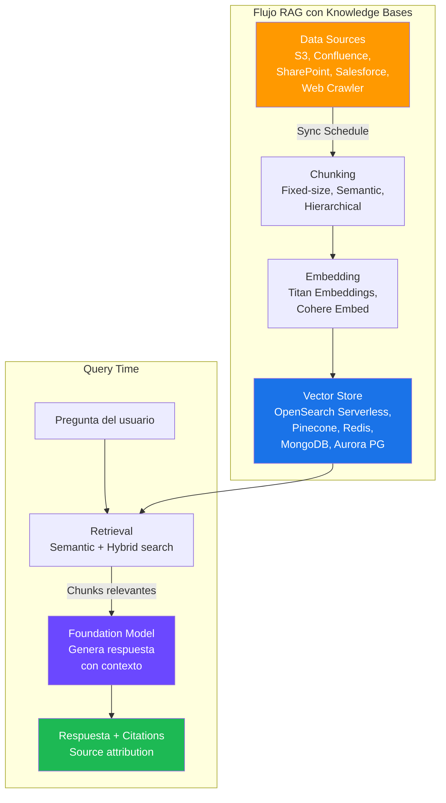
```mermaid
graph TD
    subgraph "Flujo RAG con Knowledge Bases"
        DS["Data Sources<br/>S3, Confluence,<br/>SharePoint, Salesforce,<br/>Web Crawler"]
        CHUNK["Chunking<br/>Fixed-size, Semantic,<br/>Hierarchical"]
        EMBED["Embedding<br/>Titan Embeddings,<br/>Cohere Embed"]
        VS["Vector Store<br/>OpenSearch Serverless,<br/>Pinecone, Redis,<br/>MongoDB, Aurora PG"]
        
        DS -->|"Sync Schedule"| CHUNK --> EMBED --> VS
    end

    subgraph "Query Time"
        USER["Pregunta del usuario"]
        RET["Retrieval<br/>Semantic + Hybrid search"]
        FM["Foundation Model<br/>Genera respuesta<br/>con contexto"]
        RESP["Respuesta + Citations<br/>Source attribution"]
        
        USER --> RET
        VS --> RET
        RET -->|"Chunks relevantes"| FM --> RESP
    end

    style DS fill:#FF9900,color:#fff
    style VS fill:#1a73e8,color:#fff
    style FM fill:#6B48FF,color:#fff
    style RESP fill:#1DB954,color:#fff
```

| Componente | Descripcion | Keyword Examen |
|---|---|---|
| **Data Sources** | S3 buckets, Confluence, SharePoint, Salesforce, Web Crawler | "internal documents", "enterprise data" |
| **Chunking** | Estrategias: fixed-size, semantic, hierarchical, none | "chunk strategy", "document splitting" |
| **Embedding** | Convierte chunks a vectores (Titan Embeddings, Cohere Embed) | "semantic search", "vector" |
| **Vector Store** | OpenSearch Serverless (default), Pinecone, Redis, MongoDB Atlas, Aurora PostgreSQL | "vector database", "similarity search" |
| **Retrieval** | Busqueda semantica + hybrid search (keyword + semantic) | "relevant context", "retrieve" |
| **Citations** | Source attribution -- indica que documento respaldo la respuesta | "cite sources", "traceability", "grounding" |
| **Sync Schedule** | Programable para re-ingestar datos actualizados | "data changes frequently", "weekly updates" |

> REGLA: Datos que cambian --> RAG. Cambio de estilo/tono --> Fine-Tuning. Instrucciones simples --> Prompt Engineering.

---

## 1.5 Bedrock Agents

Agentes autonomos que razonan, planifican y ejecutan acciones usando foundation models. Orquestacion nativa sin codigo custom.

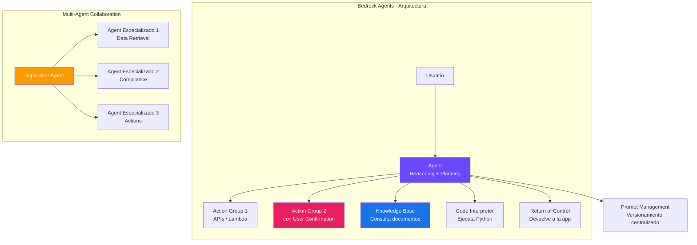
```mermaid
graph TD
    subgraph "Bedrock Agents - Arquitectura"
        USER["Usuario"]
        AGENT["Agent<br/>Reasoning + Planning"]
        
        USER --> AGENT
        
        AGENT --> AG1["Action Group 1<br/>APIs / Lambda"]
        AGENT --> AG2["Action Group 2<br/>con User Confirmation"]
        AGENT --> KB["Knowledge Base<br/>Consulta documentos"]
        AGENT --> CI["Code Interpreter<br/>Ejecuta Python"]
        AGENT --> ROC["Return of Control<br/>Devuelve a la app"]
    end

    subgraph "Multi-Agent Collaboration"
        SUP["Supervisor Agent"]
        SUP --> SA1["Agent Especializado 1<br/>Data Retrieval"]
        SUP --> SA2["Agent Especializado 2<br/>Compliance"]
        SUP --> SA3["Agent Especializado 3<br/>Actions"]
    end

    PM["Prompt Management<br/>Versionamiento centralizado"]
    AGENT --> PM

    style AGENT fill:#6B48FF,color:#fff
    style AG2 fill:#E91E63,color:#fff
    style KB fill:#1a73e8,color:#fff
    style SUP fill:#FF9900,color:#fff
```

| Feature | Descripcion | Keyword Examen |
|---|---|---|
| **Action Groups** | Conjuntos de APIs/Lambda que el agente puede invocar para ejecutar acciones | "execute actions", "API calls" |
| **User Confirmation** | Human-in-the-loop: pide aprobacion antes de ejecutar acciones sensibles | "confirm before executing", "sensitive action" |
| **Knowledge Base Integration** | El agente consulta Knowledge Bases para responder con contexto | "answer from documents" |
| **Multi-Agent Collaboration** | Supervisor agent orquesta agentes especializados (cada uno con su propio scope) | "different permissions", "modular", "specialized" |
| **Code Interpreter** | Ejecuta codigo Python para calculos, visualizaciones, analisis | "calculate", "data analysis", "generate chart" |
| **Return of Control** | El agente devuelve control a la aplicacion en puntos especificos | "application decides", "custom logic" |
| **Prompt Management** | Gestion centralizada de prompts con versioning | "standardize prompts", "versioning" |

---

## 1.6 Guardrails for Amazon Bedrock

Mecanismos de seguridad y control de contenido que filtran inputs y outputs del modelo. Operan a nivel de CONTENIDO (que dice el modelo).

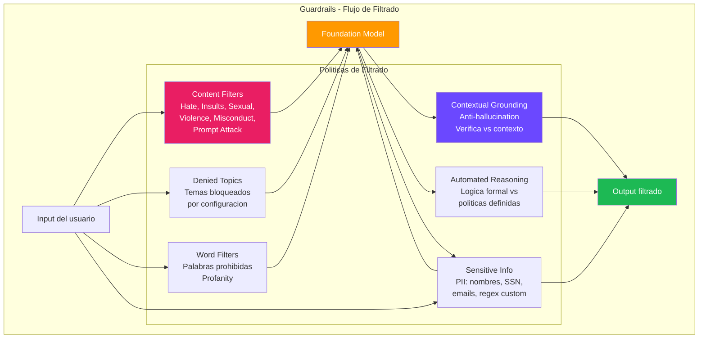
```mermaid
graph TD
    subgraph "Guardrails - Flujo de Filtrado"
        INPUT["Input del usuario"]
        
        subgraph "Politicas de Filtrado"
            CF["Content Filters<br/>Hate, Insults, Sexual,<br/>Violence, Misconduct,<br/>Prompt Attack"]
            DT["Denied Topics<br/>Temas bloqueados<br/>por configuracion"]
            WF["Word Filters<br/>Palabras prohibidas<br/>Profanity"]
            SI["Sensitive Info<br/>PII: nombres, SSN,<br/>emails, regex custom"]
            CG["Contextual Grounding<br/>Anti-hallucination<br/>Verifica vs contexto"]
            AR["Automated Reasoning<br/>Logica formal vs<br/>politicas definidas"]
        end
        
        FM["Foundation Model"]
        OUTPUT["Output filtrado"]
        
        INPUT --> CF & DT & WF & SI
        CF & DT & WF & SI --> FM
        FM --> CG & AR & SI
        CG & AR & SI --> OUTPUT
    end

    style CF fill:#E91E63,color:#fff
    style CG fill:#6B48FF,color:#fff
    style FM fill:#FF9900,color:#fff
    style OUTPUT fill:#1DB954,color:#fff
```

| Politica | Descripcion | Keyword Examen |
|---|---|---|
| **Content Filters** | Filtra contenido en categorias: hate, insults, sexual, violence, misconduct, prompt attack | "toxic content", "inappropriate" |
| **Denied Topics** | Bloquea temas especificos que no debe discutir el modelo | "restricted topics", "forbidden subjects" |
| **Word Filters** | Bloquea palabras/frases especificas y profanity | "blocked words", "profanity" |
| **Sensitive Info Filters** | Detecta/redacta PII (nombres, SSN, emails) y regex patterns custom | "PII in responses", "mask sensitive data" |
| **Contextual Grounding** | Verifica que la respuesta este fundamentada en el contexto proporcionado (anti-hallucination) | "hallucination", "factual", "grounded" |
| **Automated Reasoning** | Usa logica formal para validar claims contra politicas definidas | "policy compliance", "logical validation" |

> REGLA: Guardrails filtra CONTENIDO (que dice). User Confirmation controla ACCIONES (que hace).

---

## 1.7 Amazon Bedrock AgentCore

Plataforma agnostica para construir, desplegar y operar agentes a escala con cualquier framework y modelo. GA desde octubre 2025.

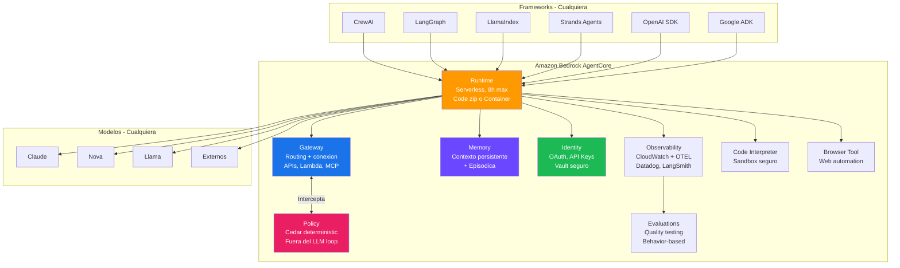
```mermaid
graph TD
    subgraph "Frameworks - Cualquiera"
        F1["CrewAI"]
        F2["LangGraph"]
        F3["LlamaIndex"]
        F4["Strands Agents"]
        F5["OpenAI SDK"]
        F6["Google ADK"]
    end

    subgraph "Amazon Bedrock AgentCore"
        RT["Runtime<br/>Serverless, 8h max<br/>Code zip o Container"]
        GW["Gateway<br/>Routing + conexion<br/>APIs, Lambda, MCP"]
        POL["Policy<br/>Cedar deterministic<br/>Fuera del LLM loop"]
        MEM["Memory<br/>Contexto persistente<br/>+ Episodica"]
        ID["Identity<br/>OAuth, API Keys<br/>Vault seguro"]
        OBS["Observability<br/>CloudWatch + OTEL<br/>Datadog, LangSmith"]
        EVAL["Evaluations<br/>Quality testing<br/>Behavior-based"]
        CI["Code Interpreter<br/>Sandbox seguro"]
        BT["Browser Tool<br/>Web automation"]
    end

    subgraph "Modelos - Cualquiera"
        M1["Claude"]
        M2["Nova"]
        M3["Llama"]
        M4["Externos"]
    end

    F1 & F2 & F3 & F4 & F5 & F6 --> RT
    RT --> GW
    GW <-->|"Intercepta"| POL
    RT --> MEM & ID & OBS & CI & BT
    OBS --> EVAL
    RT --> M1 & M2 & M3 & M4

    style RT fill:#FF9900,color:#fff
    style GW fill:#1a73e8,color:#fff
    style POL fill:#E91E63,color:#fff
    style MEM fill:#6B48FF,color:#fff
    style ID fill:#1DB954,color:#fff
```

| Servicio | Descripcion | Keyword Examen |
|---|---|---|
| **Runtime** | Entorno serverless para ejecutar agentes. Soporte para code zip y containers. Hasta 8 horas de ejecucion. | "deploy agent", "serverless", "8 hours" |
| **Gateway** | Capa de routing que conecta agentes con tools/APIs/MCP servers de forma segura | "routing", "which model/tool", "connect tools" |
| **Policy** | Politicas deterministicas en Cedar, ejecutadas FUERA del LLM loop. Bloquea acciones no autorizadas. | "deterministic enforcement", "Cedar", "boundaries" |
| **Memory** | Memoria persistente: contexto entre sesiones + episodica (aprende de experiencias) | "persistent context", "continuity", "episodic" |
| **Identity** | AuthN/AuthZ para agentes. OAuth, API Keys, vault seguro. User-level context. | "permissions", "roles", "identity-driven" |
| **Observability** | Trazabilidad completa via CloudWatch + OTEL. Compatible con Datadog, LangSmith, etc. | "monitor", "trace", "metrics" |
| **Evaluations** | Testing continuo de calidad del agente basado en comportamiento real | "quality", "test agent", "judge" |
| **Code Interpreter** | Ejecucion segura de codigo en sandbox | "execute code", "calculations" |
| **Browser Tool** | Runtime de navegador para automatizar workflows web | "web automation", "browser tasks" |

> REGLA: Bedrock Agents = agente llave en mano. AgentCore = plataforma para gobernar agentes a escala con cualquier framework.

---

## 1.8 Otros Servicios de Bedrock

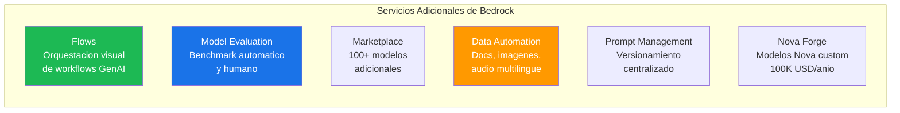
```mermaid
graph LR
    subgraph "Servicios Adicionales de Bedrock"
        FLOWS["Flows<br/>Orquestacion visual<br/>de workflows GenAI"]
        EVAL["Model Evaluation<br/>Benchmark automatico<br/>y humano"]
        MKT["Marketplace<br/>100+ modelos<br/>adicionales"]
        BDA["Data Automation<br/>Docs, imagenes,<br/>audio multilingue"]
        PM["Prompt Management<br/>Versionamiento<br/>centralizado"]
        NF["Nova Forge<br/>Modelos Nova custom<br/>100K USD/anio"]
    end

    style FLOWS fill:#1DB954,color:#fff
    style EVAL fill:#1a73e8,color:#fff
    style BDA fill:#FF9900,color:#fff
```

| Servicio | Descripcion | Keyword Examen |
|---|---|---|
| **Bedrock Flows** | Orquestacion visual de workflows GenAI con nodos conectados (prompt, condition, action) | "visual workflow", "deterministic flow" |
| **Model Evaluation** | Evalua modelos con metricas automaticas (accuracy, toxicity, robustness) y humanas | "compare models", "evaluate", "benchmark" |
| **Bedrock Marketplace** | 100+ modelos adicionales mas alla del catalogo base | "specialized models", "third-party" |
| **Bedrock Data Automation (BDA)** | Procesamiento automatico de documentos, imagenes, audio/video multilingue | "document processing", "multimodal extraction" |
| **Prompt Management** | Versionamiento y gestion centralizada de prompts | "standardize", "version prompts" |
| **Nova Forge** | Servicio para construir modelos Nova custom (100K USD/anio) | "custom Nova model" |

---
---

# PARTE 2: AMAZON SAGEMAKER AI

Amazon SageMaker AI es la plataforma completa de AWS para el ciclo de vida de ML: preparacion de datos, entrenamiento, despliegue, monitoreo y operaciones (MLOps). Incluye entornos de desarrollo, algoritmos built-in, infraestructura de training/inference, y herramientas de governance.

> Nota: En 2024, el SageMaker original fue renombrado a "SageMaker AI" y se creo la nueva generacion de SageMaker como plataforma unificada de datos, analytics e IA.

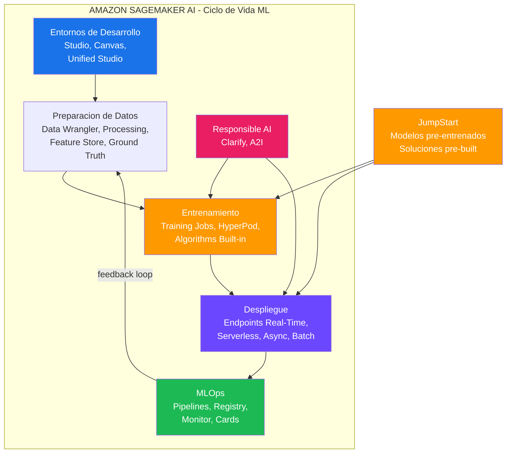
```mermaid
graph TD
    subgraph "AMAZON SAGEMAKER AI - Ciclo de Vida ML"
        ENV["Entornos de Desarrollo<br/>Studio, Canvas,<br/>Unified Studio"]
        DATA["Preparacion de Datos<br/>Data Wrangler, Processing,<br/>Feature Store, Ground Truth"]
        TRAIN["Entrenamiento<br/>Training Jobs, HyperPod,<br/>Algorithms Built-in"]
        DEPLOY["Despliegue<br/>Endpoints Real-Time,<br/>Serverless, Async, Batch"]
        MLOPS["MLOps<br/>Pipelines, Registry,<br/>Monitor, Cards"]
        RAI["Responsible AI<br/>Clarify, A2I"]
    end

    ENV --> DATA --> TRAIN --> DEPLOY --> MLOPS
    RAI --> TRAIN
    RAI --> DEPLOY
    MLOPS -->|"feedback loop"| DATA

    JS["JumpStart<br/>Modelos pre-entrenados<br/>Soluciones pre-built"]
    JS --> TRAIN
    JS --> DEPLOY

    style ENV fill:#1a73e8,color:#fff
    style TRAIN fill:#FF9900,color:#fff
    style DEPLOY fill:#6B48FF,color:#fff
    style MLOPS fill:#1DB954,color:#fff
    style RAI fill:#E91E63,color:#fff
    style JS fill:#FF9900,color:#fff
```

---

## 2.1 Entornos de Desarrollo

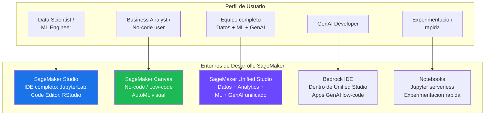
```mermaid
graph TD
    subgraph "Entornos de Desarrollo SageMaker"
        STUDIO["SageMaker Studio<br/>IDE completo: JupyterLab,<br/>Code Editor, RStudio"]
        CANVAS["SageMaker Canvas<br/>No-code / Low-code<br/>AutoML visual"]
        UNIFIED["SageMaker Unified Studio<br/>Datos + Analytics +<br/>ML + GenAI unificado"]
        BIDE["Bedrock IDE<br/>Dentro de Unified Studio<br/>Apps GenAI low-code"]
        NB["Notebooks<br/>Jupyter serverless<br/>Experimentacion rapida"]
    end

    subgraph "Perfil de Usuario"
        DS["Data Scientist /<br/>ML Engineer"] --> STUDIO
        BA["Business Analyst /<br/>No-code user"] --> CANVAS
        TEAM["Equipo completo<br/>Datos + ML + GenAI"] --> UNIFIED
        GENAI["GenAI Developer"] --> BIDE
        EXP["Experimentacion<br/>rapida"] --> NB
    end

    style STUDIO fill:#1a73e8,color:#fff
    style CANVAS fill:#1DB954,color:#fff
    style UNIFIED fill:#6B48FF,color:#fff
```

| Entorno | Descripcion | Keyword Examen |
|---|---|---|
| **SageMaker Studio** | IDE web completo con JupyterLab, Code Editor (VS Code), RStudio. Hub central para ML. | "ML development", "IDE", "notebooks" |
| **SageMaker Canvas** | Herramienta no-code/low-code para crear modelos ML con interfaz visual. AutoML. | "no coding experience", "visual", "business analyst" |
| **SageMaker Unified Studio** | Plataforma unificada nueva generacion: datos + analytics + ML + GenAI en un solo entorno | "unified", "data + AI", "single environment" |
| **Bedrock IDE** | Dentro de Unified Studio: construye apps GenAI con Knowledge Bases, Agents, Guardrails, Flows | "GenAI app development", "low-code GenAI" |
| **SageMaker Notebooks** | Notebooks Jupyter serverless para experimentacion rapida | "quick experiment", "prototype" |

---

## 2.2 Preparacion de Datos

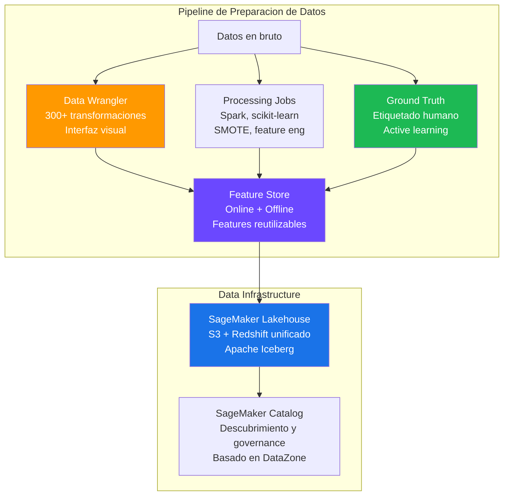
```mermaid
graph TD
    subgraph "Pipeline de Preparacion de Datos"
        RAW["Datos en bruto"]
        
        DW["Data Wrangler<br/>300+ transformaciones<br/>Interfaz visual"]
        PJ["Processing Jobs<br/>Spark, scikit-learn<br/>SMOTE, feature eng"]
        GT["Ground Truth<br/>Etiquetado humano<br/>Active learning"]
        
        RAW --> DW & PJ & GT
        
        FS["Feature Store<br/>Online + Offline<br/>Features reutilizables"]
        
        DW & PJ & GT --> FS
    end

    subgraph "Data Infrastructure"
        LH["SageMaker Lakehouse<br/>S3 + Redshift unificado<br/>Apache Iceberg"]
        CAT["SageMaker Catalog<br/>Descubrimiento y governance<br/>Basado en DataZone"]
    end

    FS --> LH
    LH --> CAT

    style DW fill:#FF9900,color:#fff
    style FS fill:#6B48FF,color:#fff
    style LH fill:#1a73e8,color:#fff
    style GT fill:#1DB954,color:#fff
```

| Servicio | Descripcion | Keyword Examen |
|---|---|---|
| **Data Wrangler** | Preparacion y transformacion visual de datos con 300+ transformaciones predefinidas | "prepare data", "transform", "visual" |
| **Processing Jobs** | Ejecuta scripts de procesamiento (Spark, scikit-learn) en infraestructura managed | "preprocessing", "feature engineering", "SMOTE" |
| **Feature Store** | Repositorio centralizado de features reutilizables para ML, online + offline store | "reusable features", "feature sharing", "consistency" |
| **Ground Truth / GT Plus** | Servicio de etiquetado de datos con workforce humana o automatica (active learning) | "labeling", "annotation", "human labelers" |
| **SageMaker Lakehouse** | Acceso unificado a data lakes (S3) + data warehouses (Redshift) con Apache Iceberg | "unified data access", "lakehouse" |
| **SageMaker Catalog** | Descubrimiento y governance de assets de datos y ML (basado en DataZone) | "discover data", "governance", "catalog" |

---

## 2.3 Entrenamiento de Modelos

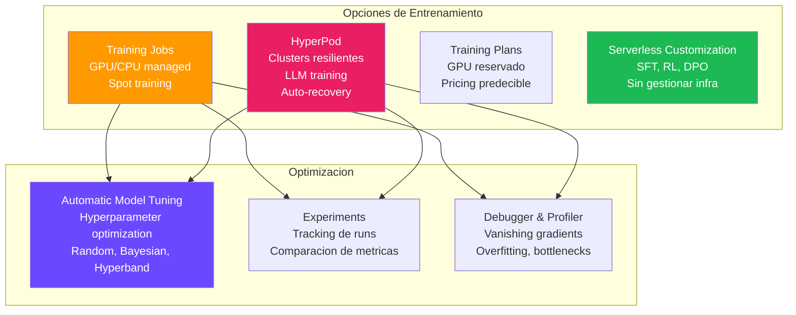
```mermaid
graph TD
    subgraph "Opciones de Entrenamiento"
        TJ["Training Jobs<br/>GPU/CPU managed<br/>Spot training"]
        HP["HyperPod<br/>Clusters resilientes<br/>LLM training<br/>Auto-recovery"]
        TP["Training Plans<br/>GPU reservado<br/>Pricing predecible"]
        SC["Serverless Customization<br/>SFT, RL, DPO<br/>Sin gestionar infra"]
    end

    subgraph "Optimizacion"
        HPO["Automatic Model Tuning<br/>Hyperparameter optimization<br/>Random, Bayesian, Hyperband"]
        EXP["Experiments<br/>Tracking de runs<br/>Comparacion de metricas"]
        DBG["Debugger & Profiler<br/>Vanishing gradients<br/>Overfitting, bottlenecks"]
    end

    TJ --> HPO & EXP & DBG
    HP --> HPO & EXP & DBG

    style TJ fill:#FF9900,color:#fff
    style HP fill:#E91E63,color:#fff
    style SC fill:#1DB954,color:#fff
    style HPO fill:#6B48FF,color:#fff
```

| Servicio | Descripcion | Keyword Examen |
|---|---|---|
| **Training Jobs** | Entrenamiento managed en instancias GPU/CPU. Spot training para ahorro. Distributed training. | "train model", "GPU", "distributed" |
| **HyperPod** | Clusters resilientes always-on para entrenar LLMs y modelos grandes. Auto-recovery de nodos. | "large model training", "LLM training", "resilient cluster" |
| **Training Plans** | Reservas de capacidad GPU con pricing predecible para entrenamiento a gran escala | "reserved capacity", "predictable cost", "GPU" |
| **Automatic Model Tuning** | Hyperparameter optimization (HPO) automatico: random, bayesian, hyperband | "hyperparameter", "optimize", "tuning" |
| **Experiments** | Tracking y comparacion de multiples training runs con metricas y parametros | "compare runs", "track experiments" |
| **Debugger & Profiler** | Detecta problemas de entrenamiento en tiempo real (vanishing gradients, overfitting, bottlenecks) | "training issues", "debug", "profile" |
| **Serverless Customization** | Fine-tuning serverless (SFT, RL, DPO) para Nova, DeepSeek, Llama, Qwen sin gestionar infra | "serverless fine-tuning", "no infrastructure" |

---

## 2.4 Algoritmos Built-in (CLAVE PARA EXAMEN)

SageMaker incluye algoritmos optimizados para tipos especificos de problemas. El examen evalua si sabes cual usar para cada problematica.

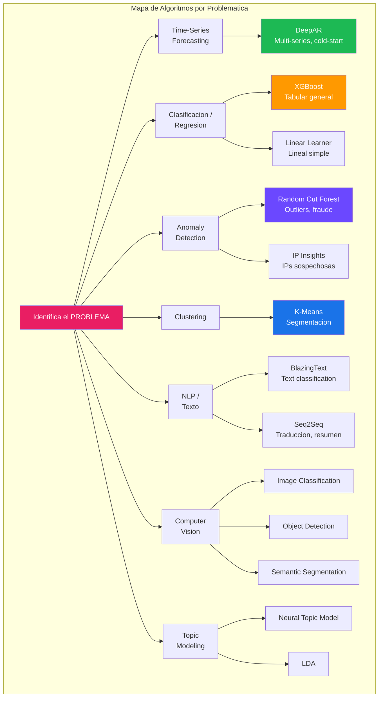
```mermaid
graph TD
    subgraph "Mapa de Algoritmos por Problematica"
        PROB["Identifica el PROBLEMA"]
        
        PROB --> TS["Time-Series<br/>Forecasting"]
        PROB --> CLS["Clasificacion /<br/>Regresion"]
        PROB --> ANOM["Anomaly<br/>Detection"]
        PROB --> CLUST["Clustering"]
        PROB --> NLP["NLP /<br/>Texto"]
        PROB --> CV["Computer<br/>Vision"]
        PROB --> TM["Topic<br/>Modeling"]
        
        TS --> DEEPAR["DeepAR<br/>Multi-series, cold-start"]
        
        CLS --> XGB["XGBoost<br/>Tabular general"]
        CLS --> LL["Linear Learner<br/>Lineal simple"]
        
        ANOM --> RCF["Random Cut Forest<br/>Outliers, fraude"]
        ANOM --> IPI["IP Insights<br/>IPs sospechosas"]
        
        CLUST --> KM["K-Means<br/>Segmentacion"]
        
        NLP --> BT["BlazingText<br/>Text classification"]
        NLP --> S2S["Seq2Seq<br/>Traduccion, resumen"]
        
        CV --> IC["Image Classification"]
        CV --> OD["Object Detection"]
        CV --> SS["Semantic Segmentation"]
        
        TM --> NTM["Neural Topic Model"]
        TM --> LDA["LDA"]
    end

    style PROB fill:#E91E63,color:#fff
    style DEEPAR fill:#1DB954,color:#fff
    style XGB fill:#FF9900,color:#fff
    style RCF fill:#6B48FF,color:#fff
    style KM fill:#1a73e8,color:#fff
```

| Algoritmo | Tipo de Problema | Caso de Uso | Keyword Examen |
|---|---|---|---|
| **DeepAR** | Time-Series Forecasting | Prediccion de demanda, ventas, trafico. Cold-start con multi-series. | "forecast", "predict future", "no history" -> DeepAR |
| **XGBoost** | Clasificacion / Regresion | Datos tabulares generales. El mas versatil para problemas estructurados. | "tabular data", "classification", "structured" |
| **Linear Learner** | Clasificacion / Regresion | Regresion lineal y clasificacion binaria/multiclase | "linear", "simple prediction" |
| **Random Cut Forest** | Anomaly Detection | Detectar outliers en datos: fraude, fallas, comportamiento anomalo | "anomaly", "outlier", "unusual" |
| **K-Means** | Clustering | Segmentacion de clientes, agrupacion de documentos | "segment", "group", "cluster" |
| **BlazingText** | NLP | Clasificacion de texto y word embeddings optimizados | "text classification", "word vectors" |
| **Seq2Seq** | Sequence-to-Sequence | Traduccion, resumen, generacion de texto | "translate", "summarize" |
| **IP Insights** | Anomaly (IP) | Detectar accesos sospechosos por direccion IP | "suspicious IP", "access pattern" |
| **Object2Vec** | Embeddings | Genera embeddings para objetos arbitrarios (pares de entidades) | "entity similarity", "pair embeddings" |
| **Neural Topic Model** | Topic Modeling | Descubrir temas latentes en corpus de texto | "discover topics", "theme extraction" |
| **LDA** | Topic Modeling | Latent Dirichlet Allocation para documentos | "document topics" |
| **Semantic Segmentation** | Computer Vision | Segmentacion pixel-a-pixel en imagenes | "pixel classification", "image segmentation" |
| **Image Classification** | Computer Vision | Clasificacion de imagenes completas | "what is in this image" |
| **Object Detection** | Computer Vision | Detectar y localizar objetos dentro de imagenes | "find objects", "bounding box" |

> REGLA: Primero identifica el PROBLEMA, despues elige el ALGORITMO. Forecasting -> DeepAR. Anomalias -> RCF. Tabular -> XGBoost/LL. Clustering -> K-Means.

---

## 2.5 Despliegue e Inferencia

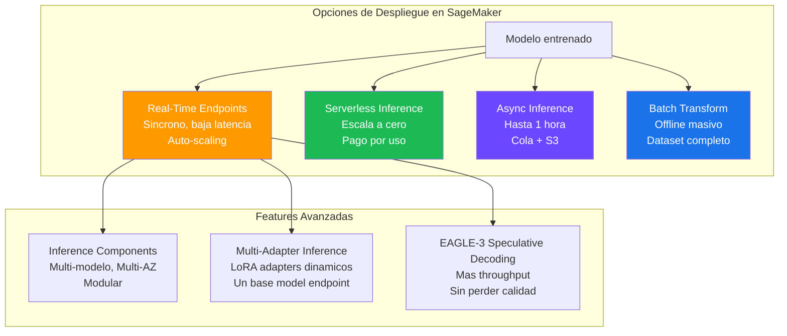
```mermaid
graph TD
    subgraph "Opciones de Despliegue en SageMaker"
        MODEL["Modelo entrenado"]
        
        MODEL --> RT["Real-Time Endpoints<br/>Sincrono, baja latencia<br/>Auto-scaling"]
        MODEL --> SL["Serverless Inference<br/>Escala a cero<br/>Pago por uso"]
        MODEL --> ASYNC["Async Inference<br/>Hasta 1 hora<br/>Cola + S3"]
        MODEL --> BATCH["Batch Transform<br/>Offline masivo<br/>Dataset completo"]
    end

    subgraph "Features Avanzadas"
        IC["Inference Components<br/>Multi-modelo, Multi-AZ<br/>Modular"]
        MAI["Multi-Adapter Inference<br/>LoRA adapters dinamicos<br/>Un base model endpoint"]
        EAGLE["EAGLE-3 Speculative Decoding<br/>Mas throughput<br/>Sin perder calidad"]
    end

    RT --> IC & MAI & EAGLE

    style RT fill:#FF9900,color:#fff
    style SL fill:#1DB954,color:#fff
    style ASYNC fill:#6B48FF,color:#fff
    style BATCH fill:#1a73e8,color:#fff
```

| Servicio | Descripcion | Keyword Examen |
|---|---|---|
| **Real-Time Endpoints** | Inferencia sincrona con baja latencia. Auto-scaling configurable. | "real-time", "low latency", "synchronous" |
| **Serverless Inference** | Endpoints serverless que escalan a cero. Pago por uso. | "intermittent traffic", "scale to zero", "cost savings" |
| **Async Inference** | Para predicciones largas (hasta 1 hora). Cola + procesamiento. Respuesta en S3. | "large payload", "long processing", "async" |
| **Batch Transform** | Procesamiento masivo offline de datasets completos | "bulk predictions", "offline", "full dataset" |
| **Inference Components** | Unidades modulares de inferencia en un endpoint. Multi-modelo, multi-AZ. | "multiple models", "modular", "shared endpoint" |
| **Multi-Adapter Inference** | Carga dinamica de LoRA adapters en un solo base model endpoint | "LoRA", "multiple fine-tuned variants" |
| **Speculative Decoding (EAGLE-3)** | Aumenta throughput de inferencia sin sacrificar calidad | "faster inference", "throughput" |

---

## 2.6 SageMaker JumpStart

Hub de modelos pre-entrenados, soluciones pre-construidas y notebooks de ejemplo. Permite desarrollo acelerado sin experiencia profunda en ML.

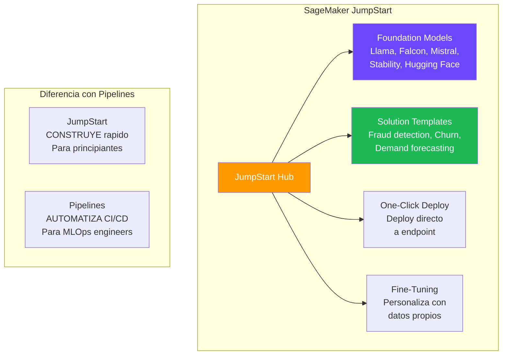
```mermaid
graph TD
    subgraph "SageMaker JumpStart"
        JS["JumpStart Hub"]
        
        JS --> FMS["Foundation Models<br/>Llama, Falcon, Mistral,<br/>Stability, Hugging Face"]
        JS --> SOL["Solution Templates<br/>Fraud detection, Churn,<br/>Demand forecasting"]
        JS --> OCD["One-Click Deploy<br/>Deploy directo<br/>a endpoint"]
        JS --> FTJ["Fine-Tuning<br/>Personaliza con<br/>datos propios"]
    end

    subgraph "Diferencia con Pipelines"
        JSR["JumpStart<br/>CONSTRUYE rapido<br/>Para principiantes"]
        PIP["Pipelines<br/>AUTOMATIZA CI/CD<br/>Para MLOps engineers"]
    end

    style JS fill:#FF9900,color:#fff
    style FMS fill:#6B48FF,color:#fff
    style SOL fill:#1DB954,color:#fff
```

| Feature | Descripcion | Keyword Examen |
|---|---|---|
| **Foundation Models** | Acceso a modelos open-source: Llama, Falcon, Mistral, Stability, Hugging Face | "pre-trained model", "quick start" |
| **Solution Templates** | Soluciones end-to-end pre-construidas para fraud detection, churn, demand forecasting | "pre-built solution", "template" |
| **One-Click Deploy** | Deploy modelos con un click en endpoints de SageMaker | "accelerate", "limited experience" |
| **Fine-Tuning** | Fine-tune modelos de JumpStart con datos propios | "customize pre-trained model" |

> REGLA: JumpStart CONSTRUYE rapido (principiante). Pipelines AUTOMATIZA (MLOps). Clarify AUDITA (fairness).

---

## 2.7 MLOps & Operaciones

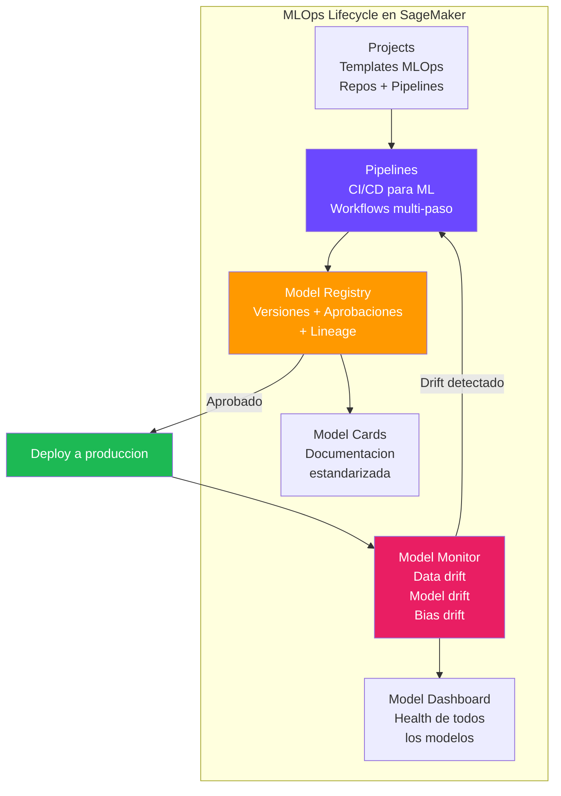
```mermaid
graph TD
    subgraph "MLOps Lifecycle en SageMaker"
        PIP["Pipelines<br/>CI/CD para ML<br/>Workflows multi-paso"]
        REG["Model Registry<br/>Versiones + Aprobaciones<br/>+ Lineage"]
        MON["Model Monitor<br/>Data drift<br/>Model drift<br/>Bias drift"]
        CARDS["Model Cards<br/>Documentacion<br/>estandarizada"]
        DASH["Model Dashboard<br/>Health de todos<br/>los modelos"]
        PROJ["Projects<br/>Templates MLOps<br/>Repos + Pipelines"]
    end

    PIP --> REG
    REG -->|"Aprobado"| DEPLOY["Deploy a produccion"]
    DEPLOY --> MON
    MON -->|"Drift detectado"| PIP
    REG --> CARDS
    MON --> DASH
    PROJ --> PIP

    style PIP fill:#6B48FF,color:#fff
    style REG fill:#FF9900,color:#fff
    style MON fill:#E91E63,color:#fff
    style DEPLOY fill:#1DB954,color:#fff
```

| Servicio | Descripcion | Keyword Examen |
|---|---|---|
| **SageMaker Pipelines** | Orquestacion CI/CD para ML. Define workflows multi-paso programaticamente. | "automate", "CI/CD", "MLOps", "pipeline" |
| **Model Registry** | Repositorio centralizado de versiones de modelos con aprobaciones y lineage | "versioning", "model catalog", "approval workflow" |
| **Model Monitor** | Detecta data drift, model drift y bias drift en produccion continuamente | "drift", "degradation", "production monitoring" |
| **Model Cards** | Documentacion estandarizada del modelo: uso previsto, metricas, limitaciones | "documentation", "transparency", "intended use" |
| **Model Dashboard** | Vista consolidada de health de todos los modelos desplegados | "overview", "all models", "health status" |
| **SageMaker Projects** | Templates MLOps con repositorios, pipelines y deployment automatico integrado | "MLOps template", "end-to-end automation" |

---

## 2.8 Responsible AI & Seguridad

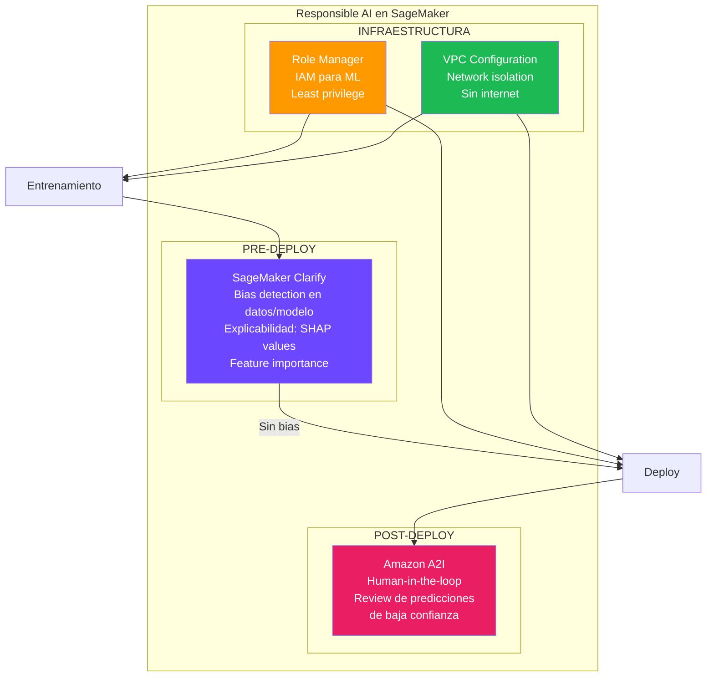
```mermaid
graph TD
    subgraph "Responsible AI en SageMaker"
        subgraph "PRE-DEPLOY"
            CLARIFY["SageMaker Clarify<br/>Bias detection en datos/modelo<br/>Explicabilidad: SHAP values<br/>Feature importance"]
        end
        
        subgraph "POST-DEPLOY"
            A2I["Amazon A2I<br/>Human-in-the-loop<br/>Review de predicciones<br/>de baja confianza"]
        end
        
        subgraph "INFRAESTRUCTURA"
            ROLE["Role Manager<br/>IAM para ML<br/>Least privilege"]
            VPC["VPC Configuration<br/>Network isolation<br/>Sin internet"]
        end
    end

    TRAIN["Entrenamiento"] --> CLARIFY
    CLARIFY -->|"Sin bias"| DEPLOY["Deploy"]
    DEPLOY --> A2I
    ROLE --> TRAIN & DEPLOY
    VPC --> TRAIN & DEPLOY

    style CLARIFY fill:#6B48FF,color:#fff
    style A2I fill:#E91E63,color:#fff
    style ROLE fill:#FF9900,color:#fff
    style VPC fill:#1DB954,color:#fff
```

| Servicio | Descripcion | Keyword Examen |
|---|---|---|
| **SageMaker Clarify** | Deteccion de bias en datos/modelo + explicabilidad (SHAP values, feature importance). PRE-DEPLOY. | "bias", "fairness", "explainability", "SHAP" |
| **Amazon A2I** | Human-in-the-loop: crea workflows de revision humana para predicciones de baja confianza. POST-DEPLOY. | "human review", "low confidence", "review workflow" |
| **SageMaker Role Manager** | Gestion de permisos IAM especificos para ML con roles predefinidos y custom | "ML permissions", "least privilege" |
| **VPC Configuration** | Ejecucion de training/inference dentro de VPC sin acceso a internet | "network isolation", "private", "no internet" |

> REGLA: Clarify revisa el MODELO (es justo? pre-deploy). A2I revisa las PREDICCIONES (es correcta? post-deploy).

---
---

# PARTE 3: SERVICIOS AWS AI/ML COMPLEMENTARIOS

Servicios de IA pre-entrenados que aparecen frecuentemente en el examen como opciones correctas o distractores.

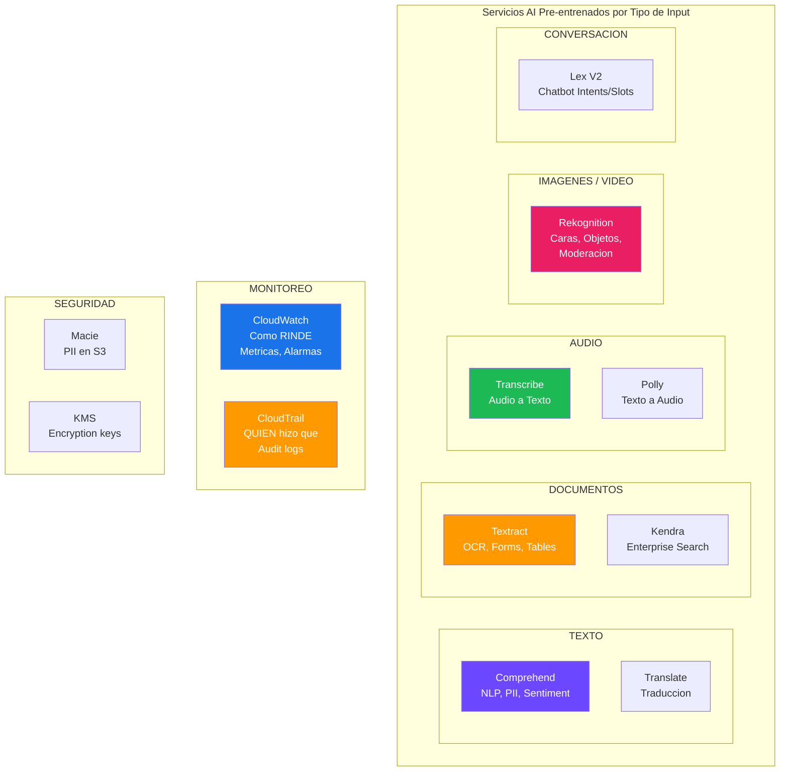
```mermaid
graph TD
    subgraph "Servicios AI Pre-entrenados por Tipo de Input"
        subgraph "TEXTO"
            COMP["Comprehend<br/>NLP, PII, Sentiment"]
            TRANS["Translate<br/>Traduccion"]
        end
        
        subgraph "DOCUMENTOS"
            TEXT["Textract<br/>OCR, Forms, Tables"]
            KEND["Kendra<br/>Enterprise Search"]
        end
        
        subgraph "AUDIO"
            TRAN["Transcribe<br/>Audio a Texto"]
            POLL["Polly<br/>Texto a Audio"]
        end
        
        subgraph "IMAGENES / VIDEO"
            REKO["Rekognition<br/>Caras, Objetos,<br/>Moderacion"]
        end
        
        subgraph "CONVERSACION"
            LEX["Lex V2<br/>Chatbot Intents/Slots"]
        end
    end

    subgraph "MONITOREO"
        CW["CloudWatch<br/>Como RINDE<br/>Metricas, Alarmas"]
        CT["CloudTrail<br/>QUIEN hizo que<br/>Audit logs"]
    end

    subgraph "SEGURIDAD"
        MAC["Macie<br/>PII en S3"]
        KMS["KMS<br/>Encryption keys"]
    end

    style COMP fill:#6B48FF,color:#fff
    style TEXT fill:#FF9900,color:#fff
    style TRAN fill:#1DB954,color:#fff
    style REKO fill:#E91E63,color:#fff
    style CW fill:#1a73e8,color:#fff
    style CT fill:#FF9900,color:#fff
```

### Procesamiento de Texto / NLP

| Servicio | Input | Funcion | Keywords |
|---|---|---|---|
| **Comprehend** | Texto | NLP: sentimiento, entidades, PII (DetectPiiEntities), idioma, toxicidad, frases clave | "PII text", "sentiment", "entities" |
| **Translate** | Texto | Traduccion automatica entre idiomas | "translate", "multilingual" |

### Procesamiento de Documentos

| Servicio | Input | Funcion | Keywords |
|---|---|---|---|
| **Textract** | Docs/PDF/Img | OCR: extrae texto, tablas, key-value pairs de documentos e imagenes | "extract from PDF", "OCR", "forms" |
| **Kendra** | Docs/Web | Busqueda empresarial inteligente (Enterprise Search) | "search documents", "enterprise FAQ" |

### Procesamiento de Audio

| Servicio | Input | Funcion | Keywords |
|---|---|---|---|
| **Transcribe** | Audio | Speech-to-Text: convierte audio a texto | "transcribe", "speech recognition" |
| **Polly** | Texto | Text-to-Speech: genera voz desde texto | "read aloud", "voice", "TTS" |

### Procesamiento de Imagenes / Video

| Servicio | Input | Funcion | Keywords |
|---|---|---|---|
| **Rekognition** | Img/Video | Vision: caras, objetos, moderacion visual, texto en imagenes, PII visual | "image analysis", "faces", "content moderation" |

### Conversacion

| Servicio | Input | Funcion | Keywords |
|---|---|---|---|
| **Lex V2** | Texto/Voz | Chatbot basado en intents/slots (pre-GenAI). IVR, flujos estructurados. | "intent", "slot filling", "IVR" |

### Monitoreo

| Servicio | Input | Funcion | Keywords |
|---|---|---|---|
| **CloudWatch** | Metricas | Monitoreo de RENDIMIENTO: metricas, logs, alarmas, dashboards | "performance", "metrics", "alarms" |
| **CloudTrail** | API Calls | Auditoria de ACCESOS: quien hizo que, cuando, desde donde | "audit", "who accessed", "compliance" |

### Seguridad de Datos

| Servicio | Input | Funcion | Keywords |
|---|---|---|---|
| **Macie** | S3 Buckets | Detecta exposicion de datos sensibles en S3 (PII, credenciales) | "sensitive data exposure", "S3 scanning" |
| **KMS** | Encryption Keys | Gestion de llaves de cifrado para encryption at rest | "encryption at rest", "key management" |

---
---

# PARTE 4: FRAMEWORK DE DECISION PARA EL EXAMEN

## 4.1 Reglas de Oro (Mnemotecnicas)

```mermaid
graph TD
    subgraph "Reglas de Oro para el Examen"
        R1["Comprehend LEE<br/>Rekognition VE<br/>Textract EXTRAE<br/>Transcribe ESCUCHA"]
        R2["Guardrails filtra PALABRAS<br/>Confirmation controla ACCIONES"]
        R3["CloudTrail rastrea PERSONAS<br/>CloudWatch rastrea MAQUINAS"]
        R4["Clarify revisa el MODELO<br/>A2I revisa las PREDICCIONES"]
        R5["RAG para DATOS<br/>Fine-Tune para TONO"]
        R6["JumpStart CONSTRUYE<br/>Pipelines AUTOMATIZA<br/>Clarify AUDITA"]
        R7["Lex CONVERSA<br/>un Agent ACTUA"]
        R8["Para determinismo<br/>K es King<br/>Top_K mayor que Top_P"]
        R9["Bedrock Agents = llave en mano<br/>AgentCore = plataforma enterprise"]
        R10["Primero el PROBLEMA<br/>despues el ALGORITMO"]
    end

    style R1 fill:#1a73e8,color:#fff
    style R2 fill:#E91E63,color:#fff
    style R3 fill:#FF9900,color:#fff
    style R4 fill:#6B48FF,color:#fff
    style R5 fill:#1DB954,color:#fff
    style R6 fill:#FF9900,color:#fff
    style R7 fill:#1a73e8,color:#fff
    style R8 fill:#E91E63,color:#fff
    style R9 fill:#6B48FF,color:#fff
    style R10 fill:#1DB954,color:#fff
```

| # | Regla | Contexto |
|---|---|---|
| 1 | **Comprehend LEE, Rekognition VE, Textract EXTRAE, Transcribe ESCUCHA** | Servicios AI pre-entrenados |
| 2 | **Guardrails filtra PALABRAS, Confirmation controla ACCIONES** | Seguridad en Agents |
| 3 | **CloudTrail rastrea PERSONAS, CloudWatch rastrea MAQUINAS** | Monitoreo |
| 4 | **Clarify revisa el MODELO, A2I revisa las PREDICCIONES** | Responsible AI |
| 5 | **RAG para DATOS, Fine-Tune para TONO** | Customizacion |
| 6 | **JumpStart CONSTRUYE, Pipelines AUTOMATIZA, Clarify AUDITA** | SageMaker |
| 7 | **Lex CONVERSA, un Agent ACTUA** | Conversacion vs Agentes |
| 8 | **Para determinismo: K es King** (Top_K mayor que Top_P) | Inference Parameters |
| 9 | **Bedrock Agents = llave en mano. AgentCore = plataforma enterprise** | Agentes |
| 10 | **Primero el PROBLEMA, despues el ALGORITMO** | Algoritmos Built-in |

---

## 4.2 Seniales Clave en Enunciados del Examen

```mermaid
graph LR
    subgraph "Patrones de Decision Rapida"
        subgraph "Customizacion"
            D1["Datos cambian frecuentemente"] -->|"-->"| S1["RAG / Knowledge Bases"]
            D2["Cambiar estilo o tono"] -->|"-->"| S2["Fine-Tuning"]
            D3["Instrucciones simples"] -->|"-->"| S3["Prompt Engineering"]
        end
        
        subgraph "Agentes"
            D4["Reasoning + planning"] -->|"-->"| S4["Bedrock Agents"]
            D5["Any framework"] -->|"-->"| S5["AgentCore"]
            D6["Intent-based chatbot"] -->|"-->"| S6["Amazon Lex"]
        end
        
        subgraph "Seguridad"
            D7["PII en texto"] -->|"-->"| S7["Comprehend"]
            D8["PII en imagenes"] -->|"-->"| S8["Rekognition"]
            D9["Bias detection"] -->|"-->"| S9["Clarify"]
        end
        
        subgraph "Monitoreo"
            D10["Model performance"] -->|"-->"| S10["CloudWatch"]
            D11["Who accessed what"] -->|"-->"| S11["CloudTrail"]
        end
    end

    style S1 fill:#1DB954,color:#fff
    style S4 fill:#6B48FF,color:#fff
    style S7 fill:#FF9900,color:#fff
    style S10 fill:#1a73e8,color:#fff
```

| Si ves en el enunciado... | Entonces piensa en... |
|---|---|
| "datos que cambian frecuentemente" | RAG / Knowledge Bases (NO fine-tuning) |
| "limited experience" / "accelerate development" | SageMaker JumpStart |
| "minimize custom orchestration code" | Bedrock Agents / Multi-Agent Collaboration |
| "reasoning, planning, executing" | Bedrock Agents (NO Lex) |
| "deterministic" / "consistent" / "less random" | Temperature baja + Top_K bajo |
| "ALL text-based communications" | Comprehend (alcance universal, no solo Lex) |
| "fair and unbiased" / "bias detection" | SageMaker Clarify |
| "human review" / "low confidence predictions" | Amazon A2I |
| "hallucinations" / "verify against sources" | Grounding con RAG / Knowledge Bases |
| "no sales history" / "new product" | DeepAR (cold-start multi-series) |
| "detect anomalies" / "outliers" | Random Cut Forest (NO forecasting) |
| "encryption at rest" + "key control" | SSE-KMS |
| "audit" / "who accessed what" | CloudTrail |
| "model performance" / "metrics" / "alarms" | CloudWatch |
| "different permissions per step" / "modular" | Multi-Agent Collaboration |
| "any framework" / "framework agnostic" | Bedrock AgentCore |
| "PII" + "images/video" | Rekognition |
| "PII" + "text" | Comprehend (DetectPiiEntities) |
| "extract text from documents" | Textract |
| "intent-based" / "slot filling" | Amazon Lex (NO Agents) |

---

## 4.3 Parejas Trampa del Examen

```mermaid
graph TD
    subgraph "Parejas Trampa - Servicios que se Confunden"
        subgraph "Monitoreo"
            CT["CloudTrail<br/>QUIEN hizo que<br/>Audit"] ---|"vs"| CW["CloudWatch<br/>COMO RINDE<br/>Metrics"]
        end
        
        subgraph "Responsible AI"
            CLA["Clarify<br/>MODELO justo?<br/>Pre-deploy"] ---|"vs"| A2I["A2I<br/>PREDICCION correcta?<br/>Post-deploy"]
        end
        
        subgraph "Conversacion"
            LEX["Lex<br/>Chatbot RIGIDO<br/>Intents/Slots"] ---|"vs"| AGT["Agents<br/>Agente AUTONOMO<br/>Reasoning/Actions"]
        end
        
        subgraph "Texto"
            TEX["Textract<br/>EXTRAER texto<br/>de docs (OCR)"] ---|"vs"| COM["Comprehend<br/>ANALIZAR texto<br/>existente (NLP)"]
        end
        
        subgraph "Seguridad Agentes"
            GRL["Guardrails<br/>Filtra CONTENIDO"] ---|"vs"| UCN["User Confirmation<br/>Controla ACCIONES"]
        end
        
        subgraph "RAG vs Actions"
            KBR["Knowledge Bases<br/>BUSCAR info"] ---|"vs"| AGR["Agents<br/>RAZONAR y ACTUAR"]
        end
        
        subgraph "SageMaker Tools"
            JST["JumpStart<br/>CONSTRUIR rapido"] ---|"vs"| PIP["Pipelines<br/>AUTOMATIZAR CI/CD"]
        end
        
        subgraph "Visual vs Texto"
            REK["Rekognition<br/>Analiza IMAGENES"] ---|"vs"| CMP["Comprehend<br/>Analiza TEXTO"]
        end
        
        subgraph "Audio"
            TRS["Transcribe<br/>Audio a Texto"] ---|"vs"| POL["Polly<br/>Texto a Audio"]
        end
        
        subgraph "Agentes"
            BAG["Bedrock Agents<br/>Llave en mano<br/>Solo Bedrock"] ---|"vs"| ACC["AgentCore<br/>Plataforma abierta<br/>Cualquier framework"]
        end
    end

    style CT fill:#FF9900,color:#fff
    style CW fill:#1a73e8,color:#fff
    style CLA fill:#6B48FF,color:#fff
    style A2I fill:#E91E63,color:#fff
    style LEX fill:#888,color:#fff
    style AGT fill:#1DB954,color:#fff
    style TEX fill:#FF9900,color:#fff
    style COM fill:#6B48FF,color:#fff
```

| Par confuso | Servicio A | Servicio B |
|---|---|---|
| **CloudTrail vs CloudWatch** | QUIEN hizo que? (audit) | COMO RINDE? (metrics) |
| **Clarify vs A2I** | El MODELO es justo? (pre-deploy) | La PREDICCION es correcta? (post-deploy) |
| **Lex vs Agents** | Chatbot RIGIDO (intents/slots) | Agente AUTONOMO (reasoning/actions) |
| **Textract vs Comprehend** | EXTRAER texto de docs (OCR) | ANALIZAR texto existente (NLP) |
| **Guardrails vs User Confirmation** | Filtra CONTENIDO | Controla ACCIONES |
| **Knowledge Bases vs Agents** | BUSCAR informacion (RAG) | RAZONAR y ACTUAR |
| **JumpStart vs Pipelines** | CONSTRUIR rapido | AUTOMATIZAR CI/CD |
| **Rekognition vs Comprehend** | Analiza IMAGENES | Analiza TEXTO |
| **Transcribe vs Polly** | Audio a Texto (STT) | Texto a Audio (TTS) |
| **Bedrock Agents vs AgentCore** | Llave en mano (solo Bedrock) | Plataforma abierta (cualquier framework) |

---

> Exito en el examen, Diego. Usa esta guia como referencia rapida durante tu preparacion.
